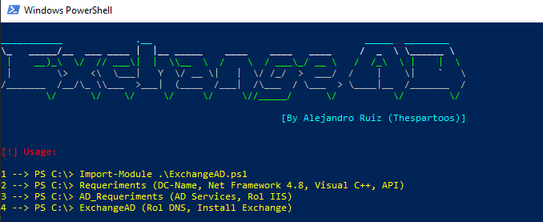
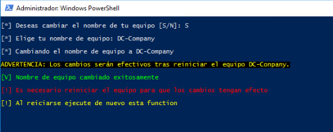
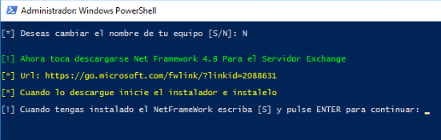
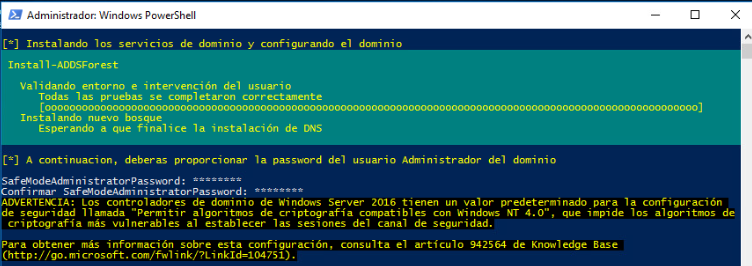

## Exchange AD Install

	<img src="data:image/png;base64,iVBORw0KGgoAAAANSUhEUgAAASEAAACuCAMAAABOUkuQAAAA3lBMVEUAZ6QAa5////8AaKMAa6AAbJ0AZ6YAaKIAaaAAZKIAXp7///3//v9ilLwAZ6f8//+Qtc70//8AYJ4ncagAW5jV6fYAY57N5PMAWpu31Od8q8kAXZoAYqJFhrOrxt7k9P2qy95pn8IAXaEkdaYAX6MAXZX///hUjrnu+/8AYZi+2uglbpwAVZqextwAVZPb7/cze696p8qHss3P7vpjl7XE5fZTiavN3uuTudeCtNdOirc8gamav9ih0efO6O/m//9ilcOJqsS/0Nyaus0kdqIASojt8verzulGhLmGrdMbcNfQAAAS70lEQVR4nO2ciXraSBaFy5K7tEHJEkIIJMxuFmOzJB07CZNJd0+7M+//QnNuSTJgsItkOp3kS51sGKSS9OvW3UqE2YxbTOsFaUIqaUIqaUIqaUIqaUIqaUIqaUIqaUIqaUIqaUIqaUIqaUIqaUIqaUIqaUIqaUIqaUIqaUIqaUIqaUIqaUIqaUIqaUIqaUIqaUIqaUIqaUIqaUIqaUIqaUIqaUIqaUIqaUIqaUIqaUIqaUIqaUIqaUIqaUIqaUIqaUIqaUIqaUIqaUIqaUIqaUIqaUIqaUIqaUIqaUIqaUIqaUIqfQYhzphp0gvBv+IJfXf6XBsS3DLZT2V1n0HIZJxzWJHg5lc9pe9MnznL5LamJnRcHL/i0E0S5yf3Q+Xlm/tvOlnopvayum6+Gmf/0Ml9F3pKiJvkZuBwiBC9YNzJhkl81u5dNOsT34Cqzrc622+hQ0KAIgkRIDKc22Xv4q4eEBoP+ukJWZxZ8o1s2E+m1+PVpvEg4RhepWIYvv/TE2KCWcN+ZA96626jIy2H8NDv3Ig0IcSrcbOROxzIBxWjQuaTzzFNCIjcC2NXXqW0o/KfagYXJQR5q10xvpMFmFYxrEUq3sNep6VSvHCEwvz26fuBp+ZPCe0rtyGTZD0RfLzJxd5QTxmaJyZfcIZO5mDCfwfp+5cRskReg5RXTvsxSc3cjiPfyH+Wr4igdeIVW9Zy2a45Fv/2yemXEWLuMHTDXbmumzFLFCZkYRwnyzI3c6Uy+jeGBVni2EkcUfjKMG7cU7f+mvoyQk7r4kDrccp4kYmDEAurrX31poJbp9pEWPeMy/42w/92eoGQjOzyL/xdMSo7hNLOMXoX7u71RM0nH9dHjwSVMsO6YVwmmGXf3BG9QKhS4NnhtSXk5fJLbvTDBAjMYhSLuyBU8f3tCI2Is1OnTU4IxL/zWAYcfjBZNJqX69cf/C2hLOx4SK+9imd42229oLZDiIGQ5wU7+hVu5WST+CEIed6iOm6fjaIkcYe3sx0/lMVvm0gjYSLG7OIevy4u/kBqGQyeEvLfnNUGuWq1M5Mjnp14Xj8EId9rzJ1YtoWQRu4Sckw3upC1yCx1XUQ1NxnBMwUD5ymh9m6jxETUPzmW/QCEPN9oJEw2pXHd8z1CyKiTCyCsTzMuW2sizgmJPUKG347L/JgSKCEv+IkZ8aMvSkLleI+fP7P3/ijHLVXe6+eiI3/uk5dmGXwrKlk3TdPpdHq3S8iK4+wW71TdLB1NwynjklDNZE9taKeEM/M/VrlUIlNsWBWyKOTONsuKzJKXhLrFDaLWuLVdYqEAl6eiwi6vSs5eZPQWYoEpk1krHwcvbWqu40CoYej4GOoxrRU4LJm9SW0x+7h9KwiZlnvfaCwmQeDtemr31a9xXDe6UdiudzqTt2FBiL1EiM7F4WRm+WUhwSZj5PJn2JdJaWV/6JC15TaUIPg5bt9N45iJsrjjtA82TfpxBrbl1TpOXvTElKHiICLb1oA2toczxSDSGkWxFkFzOMtCt993M9SOz/hIFSGW3MlI7+1G+xhep74wunHyLqAPLk4jZPHade3c5GUpIeLz6/MBZ/I+DpNBb33T3azH1ojFuQ25lhO9720u71ftNC7ScVhSGtWq601302pP02FxwLPz8zOHW5HVu6APRrHFC3gmH7rT8fqyu1nVRhmzz2vXpbHQUd+1Nt2bVnUaii+bZaaYzzyfEkZjlxAyRkS6OHwXXMEbGfcnEeJW9jbwg/qovLfJ2g/8f4XInUQ8Xd0VzSgjaDqFDfXdZaNIqOrtMh0Nazcfyk0XF7Eth05/9YN/R870Mv/E7/RGvDTVuLbplCN/iuiY1TifgCJadYrxJ/cx7suXEDKT3ynzkY57O8uSBX6sJktYkH+6DTGWfsAAqzA/d6cWeEbHFjS/BvWyPYe/O3FBaN7zy5zeCN47cmynGjxm+rhvTVceb9hA7nVrd+T5eQYStVZxvdwdlztUcLZvWnjxMZNWJFKcYqU4qNGIv8yGeDIrY/+OpyYbqrsOJmClgqRoHYrRxDskZGyjvQmrF1bWwwD1iH426TieXw3hHAR8Gq42aDS7TZDuwGFIQtMJzKTZvZNtvNmtoII4XGEIvzPrdmcBNfiqMfVF04aBlL6BfeUQyNUmNrl0GJK9oLxtMmt2yfQWv2H3agaP7jg23UN80p1N6MUfIWPssJmg9ENZtdXr9aq/7c6yLMF1tGwyJLoHiMruzKtUjtjQ+4wLKDMz7piWcEYzoFi5HFEnu8YJX8zJW9KlGcHmlwj+NGrfvHKcDMyM3+uYXPMoTewbql7GriyIW8bksh0hjY2ugcWjSSu4JPS7EfSSkZtELR9ntklpCZRFOKI3aY0S7DKY+caDJIQIJyI6wc74Nukn8RhUsQc7UhYpZxnLwjBz3LaxO8tQlxl/LAzv4TdciF+9ncJZVbynhGD4b4qU+j/4lw6fDQKaRTE2AGBj4VKMijY4vUW7WKkc9s+ZRYRgNx9Sutsxm9PcWExlGvC2O+qTv+Yim3bgBtu0+hA2MN2NYOnCPQuWtGDyD3YGZ+3C5LzOsk+5quXM38hSqeqI2HYxplePQ7l0kV1PqCY4VhYpZ5mMkNbw3Z6ndn+Vix++X52P74xg3THkLDmYZZ6/1WJEPcNwBdK4WXHShfEvHbo6mjeLaSa4bMshM0HORDbkTc4ck9wUEwl5mDZ5IoQy6qtxRGyrj6wVbg17pURo0k7h1ZBfmfNL2pwaVuECgMzYpIwK9gF2khDOJCYm10VGK/r4wFgPzc8nxCg5zJz+HiEnSy8NnzxQ0I7m99IRHiXkl4UteC6GMkecbwzv31NH1EDqJqE8N6p7ZPixmXe0bZPmJREyNomQDW/kHF2anRlY2DblMzAV07bEeOJ5GxcZYQxClD8NwQ12kI1xxJZLPgIv7l25G7XMRTiRs4xZwx7oXvYpQcXhTAfGbcySgzl2QrTPlu/a7fb713v9ISu8beLycWWd8ShqBYgq/rFYttM9MTppnq5dw6d3I1yynJVy4uHDKdlqUaFYlvTdxgRsBC6AS++TXzITuDqL3qYuJrwwuABjDD9kfIRp2GQQ3FkiDVnjgCniDJyhJRePsR2HW5J+yOwT83FGtSL9YUNY6SLkh65a6YdQsvrGtstT9Bhv2n8ivsr3N0myrMuM4JCQQV6+0Mc88HPyDEZ1SWHfpcrA7RlkTeZ+wkaxbJaYRSbNnapBHToyHaTK8Ivw1OGy2nrwqDbB5iAU2I+pBZ/CUd7Egg0m8HBpWU/TdNzkhCwkLN7DbUIeH0qiP+8wq2visMWnJETQKwRjx1M7LnJqCsvvO8aVsbnNbluUUhyZZf9xMyknE3F+HEtEM5jenWc0b5EAcJ7c4Ga+DsV+CzvPqTnfJbTpwwOhfotG1ftmvRP4MiXqugWhyWhbvkYg1I153MaNa5b0iVC4NqSnNlPUUQ/NHSHI+QPnsH5V59SYTqCTLyqWhEYPNIPuzj/Jnzcj3l/Bng5tKCjyIW7+YhZlkmXRtMJuzbmguMOiJn5oO8I+QugxtOSEXHq6Kxk3AqNsEANAScjfIcRuiZDD44/YcjO0SkImeyR0BidxteME6BYjcnyBp07IhspnGkpCIaUPi0TS8yi4Of3OkVlWQcaYLxcNH5sXyA+pt+T711SiAhJ1nnzqLB3MskuXFctJvCTEEY383CX6k8bF68V2lhmT6IkNOcxZYcP7YbGoRA28ghDnA3/fTcpra2fioCGljPa4UH9vFMqHog7Zh7v0r6gR6927qDoqx2zovSMJUeFslssgZkQJorGe47QBRhJC2N/3AJJQ9IQQoqHTDq5grc3WeDlNwjTvkTxDKGbZCjThvoq782hDGRFCytS96UKX+CV/39QY/4xZRqUKRWPrfNkeV3urvYxxYQRvUt4o3ji5LpMfRWtkClRwyOUwnpBHHztPktmyg1bs5FDURlwX0Qf4u40dhQ7ySzF9nhA+cMwYu3mbsLBPajD1L/JZZtmB79Vv+/3ILZUk6bEHEl5c62gkJpIFFuNmhKNg14YmwZu+2zA+tKRLOK22Lw4Qv8fE/I2m4MChBA2eGiVM+qR/td+FLQlZGeVlrbko3v1lcZwQKwg57zABZlEZwZFXy/sBQjyZGJWJTA7kUOxYSaYiZHjUhZXN5YwJO/B2ov3bgYNa4cFKqhQGes7phMwYvmOW1oC2TpUTk9XszDVPIDQ007/IaRWzxsx6wUuEUNNSUOhY26d3BaxfVq6C+l7GO7f8wPoSQphlfyYkN7NiJ96xIcdGEB+gPByHjpv0o5idTij5r8xcKGM0eiESHod6KMFZth9EjtuQGFEiWSucutXfGC8SEnyErMcfD1nZU8zaviRks/SGRuzvXvrxFtqLq0H+5OHDrLtp9T5+Gkx3ZxkONUUG4k/aVKYLdjqhsDcxqAwQ1zKTpvCSUD68Sban4TxPKKrTYbLiUmwUHS8Rkr0SZJ63j1MJpUBFemrmUGEyOROPl83D4w+wqlalSwWT3YwROS2l2hVj0oaN9ZNkPqLoVrOcwhK4DILbjFFmjdzissRYUK3ZX2P37tziZjwGNH8dZ/kzpnFSQxJAVUc3LZsRHPWVb2xi0aeUeDWH6Vkio9aVb3Spbk+PE2IMs4oSK9xTnJmDwjWvXJE7J1Qbz9w4v2g2jHpvs2NG9EVPNmRZc1E8kxY0PjTq9UYD1nzl13bWMYSLTNBvjatbLZHJkr2MQ44MetTMa0gU7lXK/OrjKHLTNGl3X02R+9KTDQm3i9OKZQUaMrYE4WAd0V0ZNIzFg+d1E9RpMREa7RKiaC9g61W5rLW8TYZJtGz4fnFUYWLCIROuv4somiFNnyH5/sxY9jwhqjquKqhFiufT8inpY5aVdRRsKGpuS/tc98n0LQZo9jExUZzSImTnnPoY7oraNv6iu9l0Fz7VuGZYv0Llze0cOdkQNU2Elch6GFt2kVk/nDUAIjWFQFytTKLtVSQylnERs2RDJ+3fYQ9aWL9v5RkjzrRPL6+MTvNy023CjL2/kRB18n1q+3pFuk11m+d10rL8JEJp8/HRvpLQ3OqAZHsq8xPRv8d7zb4JOxmR2yw29jEOMpk61ROiWIDjsovxRwpe7WDbZfhvRNE+xNWOGt6TusynWMaF6divjGIPij1Jq6g6TO7E977hVx4vzN+4f98sczt7ibYvf09eZ2Ibs6Uf2tfFnN7qJnmeDIbkI1oZ2UlSfVX6OX+xmub9ob8SXnyHxJQ59X2GMJ+268VwnZ4bE6EUlQx56mC074f+ilEZM4vbN49LI71pkmeMXFAmlLQbftH7N4K/3qdH+BwjxEL1LIvbh1rG2c5IuEXLdvvT3hY1k1pNjG4tBSkzrtG7uJ8Wt8Jk0Lqc3TVvVoN0SAUrPqFKOycOU5I/C8vkWTpeN2ezTS+G8eAAS+r+OHKk7eHp56Uj5zyi6rS6mWGPj2Eshjcyg8ddMelhyWQpj9pdV63kxPUyuHxag3isVI8TYs4RPT3A4RbsyWb5m+UPtC6K3MvZfvZ0tOIlPQyPDffePbb547cLeD40lcr0/IFf28Z1J0vpo/BoGDtKCHWAJHRQ+O4T+ioyT/5iVv4c6WlbUvEry2Y5fNy5Mia3O+Yi0+2Xxjp4nto0hzTLyn7QP0mofK5WKdN8NgPek0XLcpJQDhUlJhWFjfkuEdVRj3y/TPqhZ0zo69rQ49PFyi1Pgpk/W5N/y4lki4xSEGOV7XZadh6JP6rD73VYrLa6L78o9c/aEHv26Z69zYq6VQlTQjSTjD/W7rc9mNAsFrvdOq6gfcSGuBOGUWrRl+3uJjJQVvIvd8hX+Kfqqi/juxBSd/d+Nk6TTK6MJANafw0G2ckPnJKOf4sTTK0YASC1z8brRiDNyc8ffqVHGn6Ub74gOyOXsej2zm77Z6+bAa3gt1zzsNX6gp4lZFryuSfhusxut27uHr9J5cmHCX4E0TJrSCvehj/pdDAdrmgBIaXlgM94Svu5bwIXX84xLeoyZvQY2Pn71WYm3dPHH+R7rvQliZi6Ldvqp7NyRf4038k6Sih3XFbRRS/XIbMwjUJ72Vt/+lFmGeU68XmvKx8zDBaNTTuWN/e5x82O6plZJh9dZSUrM1/VlaEhc0PnM2z0m4oIcZ5FSXx2dmZb1P6nqxLPPbJ4VD/H/4yiiugv6ecg9P9IE1JJE1JJE1JJE1JJE1JJE1JJE1JJE1JJE1JJE1JJE1JJE1JJE1JJE1JJE1JJE1JJE1JJE1JJE1JJE1JJE1JJE1JJE1JJE1JJE1JJE1JJE1JJE1JJE1JJE1JJE1JJE1JJE1JJE1LJPv2/+/1JZZmWeYosdtp2tCH7e0ek//nUPGlMduqYp29osrNzrRfFftF6WeyM9K3v0/esnJDW89KEVNKEVNKEVNKEVNKEVNKEVNKEVNKEVNKEVNKEVNKEVNKEVNKEVNKEVNKEVNKEVNKEVNKEVNKEVPofZLLUsTMIFVgAAAAASUVORK5CYII=" align="center">

**ExchangeAD** es una herramienta en PowerShell la cual te automatiza el proceso de instalación de Microsoft Exchange en un servidor Windows Server.

Esta herramienta cubre la configuración del servidor y la instalación de los siguientes recursos:

- Net Framework 4.8, Visual C++, API, Rol DNS, Rol IIS, rewrite IIS

:warning: Con esta herramienta puedes descargar Exchange Server 2016 en un Windows Server 2016 y Exchange Server 2019 en un Windows Server 2019.

## Requisitos

- Windows Server (2016, 2019)
- Espacio en disco:
	- Al menos 30 GB de espacio libre en la unidad donde va a instalar Exchange.
	- Al menos 200 MB de espacio libre en la unidad del sistema.
	- Al menos 500 MB de espacio libre en la unidad que contiene la base de datos de cola de mensajes.
- Procesador:
	- Procesador Intel compatible con la arquitectura Intel 64 (anteriormente denominada Intel EM64T).
	- Procesador AMD compatible con la plataforma AMD64.

## ¿Cómo ejecuto la herramienta?

Tras importar el módulo, sera posible ejecutar las funciones existentes:
- Requeriments
- AD_Requeriments
- ExchangeAD

### Requeriments (función)

Con esta función al principio puedes cambiar el nombre del equipo. En caso de que no quieras hacerlo, escribes la tecla "N". **Al cambiarse el nombre se reiniciará el equipo**

:warning Después de eso tendrás que instalar **`sin reinciar`,  (Net Framework 4.8, Visual C++, API)**

:warning: Recomiendo que cuando vayan a descargar las dependencias y copien el enlace que desactiven para que les deje descargar tranquilamente.

![[internet.png]]

### AD_Requeriments (función)

Ahora pasamos con la siguiente función que con la cual vamos a crear un dominio en el Windows Server e instalaremos todos lo roles necesarios.

Por último el equipo ha de ser reiniciado.

En el caso de que estuviera unido a un dominio pasará directamente a descargar los roles necesarios que necesitamos para instalar el Microsoft Exchange en WIndows Server

### ExchangeAD (función)

La última función consiste en instalar unas últimas dependencias y el Exchange Server

Primero debemos de descargar y montar la ISO de Exchange Server

Comienza la preparación de la instalación de Microsoft Exchange

Cuando termine el proceso de las instalaciones previas comenzamos con la instalación de Exchange Server. En el primer paso le daremos a que nos busque actualizaciones online y le damos a continuar

El siguiente paso es utiliza la opcion recomendada

Ahora vamos instalar el rol (Buzón) de Exchange, asi que lo seleccionamos y le damos a continuar.

Por último la configuración de protección de malware la dejo en "No" y le doy a siguiente y por último le daremos a instalar.

